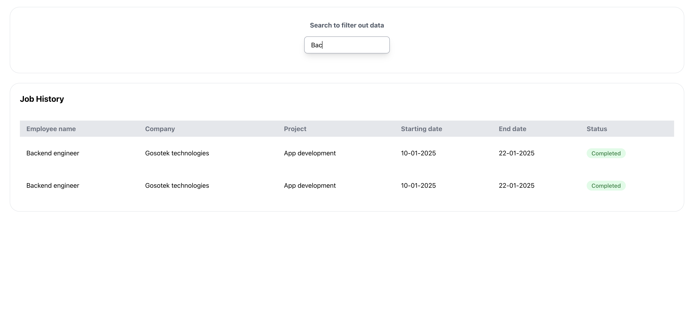

This is the project which contains multiple react components which handles different tasks. Divided into small chunks.
## Let's Go and Get started

### Question 1:

There is a table in with few data entries. We have to create a search box which searches the values from the data and filter the data table simultaniously.

